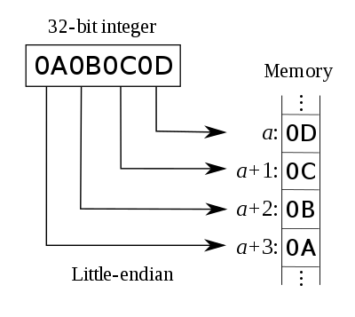

# Endian

Endianness refers to the sequential order used to numerically interpret 
**a range of bytes** in **computer memory** as larger, composed word value.
It also describes the order of byte transmission over a **digital link**.


## Big Endian


## Little Endian



The little-endian system has the property that the same value can be read
from memory at different lengths without using different addresses. 
For example, a 32-bit memory location with content 4A 00 00 00 can be read
at the same address as either 8-bit (value = 4A), 16-bit (004A), 24-bit 
(00004A), or 32-bit (0000004A), all of which retain the same numeric value.


## Bit swap

Some CPU instruction sets provide native support for endian swapping, 
such as __bswap__ (x86 and later), and __rev__ (ARMv6 and later).

Unicode text can optionally start with a __byte order mark__ (BOM) to 
signal the endianness of the file or stream. Its code point is *U+FEFF*. 
In UTF-32 for example, a big-endian file should start with ```00 00 FE FF```; a little endian should start with ```FF FE 00 00```.


# References
* [Endianness](https://en.wikipedia.org/wiki/Endianness)
* [Big and Little Endian](https://www.cs.umd.edu/class/sum2003/cmsc311/Notes/Data/endian.html)
* [Understanding Big and Little Endian Byte Order](https://betterexplained.com/articles/understanding-big-and-little-endian-byte-order/)
